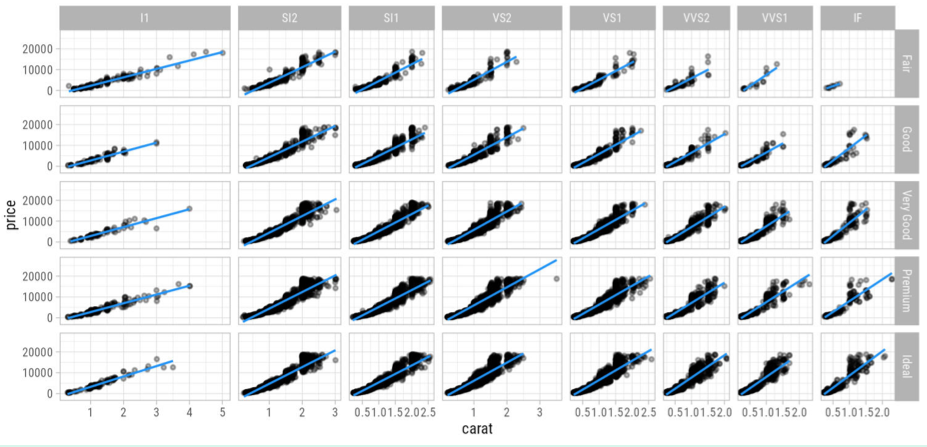

# Exercise 1

```{r setup, include=FALSE}
knitr::opts_chunk$set(echo = TRUE, message = TRUE, warning = FALSE, 
                      dev = "ragg_png", dpi = 300, retina = 1)
Sys.setlocale("LC_TIME", "C")
```

## Data import

```{r preparation, warning=FALSE, message=FALSE}
library(tidyverse)

data <- diamonds

str(diamonds)
```

## Create diamond visualization



```{r plot}

```

Add your comments and more code here.
